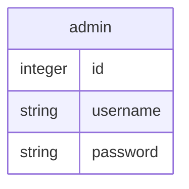
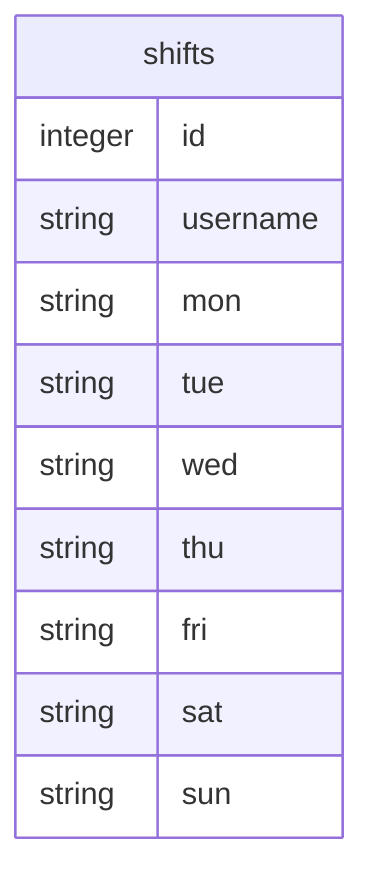
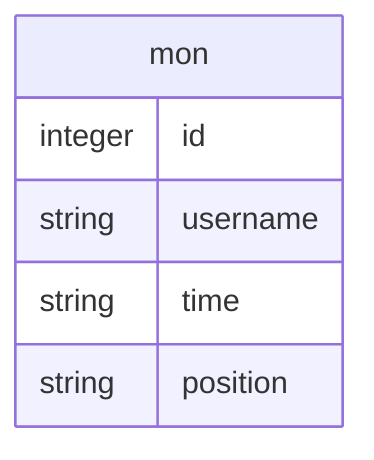
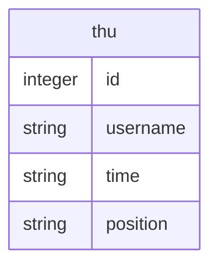
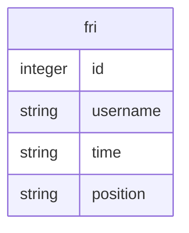

# シフト管理アプリ「sadmin」
## 概要
このシフト管理アプリは、アルバイトとして働いている従業員のシフトを管理することによって、雇用主の負担が軽減されるシステムです。

従業員は、毎週Webアプリ上のフォームで次週の勤務可能日と勤務可能時間を提出します。管理者アカウントをもつ雇用主は管理者画面から各従業員のシフトの提出状況を確認し、何時からどの従業員を働かせるかを指定します。最後に、雇用主はシフト管理画面からシフトを確定させて公開します。

## 使い方
1. 

## システム構造
メイン：Python Flask 2.2.3  
テンプレートエンジン：Jinja2 3.1.2     
データベース：Sqlite3   
ORM：Flask-SQLAlchemy

実行環境
## プログラム構造
```
tree
.
├── README.md
├── app.py
├── instance
│   └── shift.db
├── static
│   └── index.css
├── templates
│   ├── admin.html
│   ├── checkdelete.html
│   ├── checkshift.html
│   ├── collect_shift.html
│   ├── index.html
│   ├── login_admin.html
│   ├── shift.html
│   ├── signup_admin.html
│   ├── submit_success.html
│   └── submit_shift.html
└── venv
```

## データベース構造
データベース











