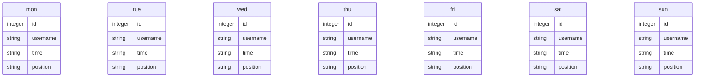

# シフト管理アプリ「sadmin」
## 概要
このシフト管理アプリは、アルバイトとして働いている従業員のシフトを管理することによって、雇用主の負担が軽減されるシステムです。

従業員は、毎週Webアプリ上のフォームで次週の勤務可能日と勤務可能時間を提出します。管理者アカウントをもつ雇用主は管理者画面から各従業員のシフトの提出状況を確認し、何時からどの従業員を働かせるかを指定します。最後に、雇用主はシフト管理画面からシフトを確定させて公開します。

今回は、最低限使える状態で公開し、1度アルバイト先の従業員さんたちに使っていただきました。そのフィードバックから得られた点を今後改善する予定です。
## 使い方
1. 雇用主は管理者画面にログインし、過去の提出されたシフトを削除して今週のシフトを募集します。

    ログイン
    
    「シフトを募集する」を選択
        
    「はい」を選択
    
1. 従業員はシフト提出画面からその週のシフトを提出します。

    
1. 雇用主は管理者画面からログインし、提出されたシフトを確認します。

    「ログイン」
    
    
1. 提出されたシフトを確認したら、誰を何時から働かせるかを入力します。

    フォーム内に何時から出勤にするかを入力します。
    
    その日は出勤させない時は、無入力もしくは'x'を入力します。
    
1. 誰を何時から働かせるかを入力したら、誰をどのポジションで働かせるかを入力します。

    
1. ポジションを入力したら、シフトを確定させて公開します。

    

1. これで従業員からシフトが確認できるようになります。

    


## 実装
1. Pythonのインストール
1. フレームワークのインストール     
    Flask, Flask-login, Flask SQLAlchemyをインストールします。
    
1. データベースの初期化
    ```Python
    % python3
    >>> from app import app, db
    >>> with app.app_context():
    >>>     db.create_all()
    ```
## システム構造
メイン：Python Flask 2.2.3  
テンプレートエンジン：Jinja2 3.1.2     
データベース：Sqlite3   
ORM：Flask-SQLAlchemy   
実行環境：Conoha VPS
## プログラム構造
プログラムの構造は以下のとおりです。
```tree
.
├── README.md
├── app.py
├── .gitignore
├── .env
├── instance
│   └── shift.db
├── static
│   └── index.css
├── templates
│   ├── admin.html
│   ├── checkdelete.html
│   ├── checkshift.html
│   ├── collect_shift.html
│   ├── index.html
│   ├── login_admin.html
│   ├── shift.html
│   ├── signup_admin.html
│   ├── submit_success.html
│   └── submit_shift.html
└── venv
```

## データベース構造
データベース



## フィードバックから得られた今後改善する点
- 従業員にもユーザを割り当て、過去に提出したシフトを編集する機能の実装
- 過去に公開されたシフトの情報から従業員ごとにその月の給料の計算し、表示する機能の実装
- シフト提出期限が近くなると、メールもしくはLINE@を使って提出するように通知する機能の実装
- スマートフォン向けUIの改善